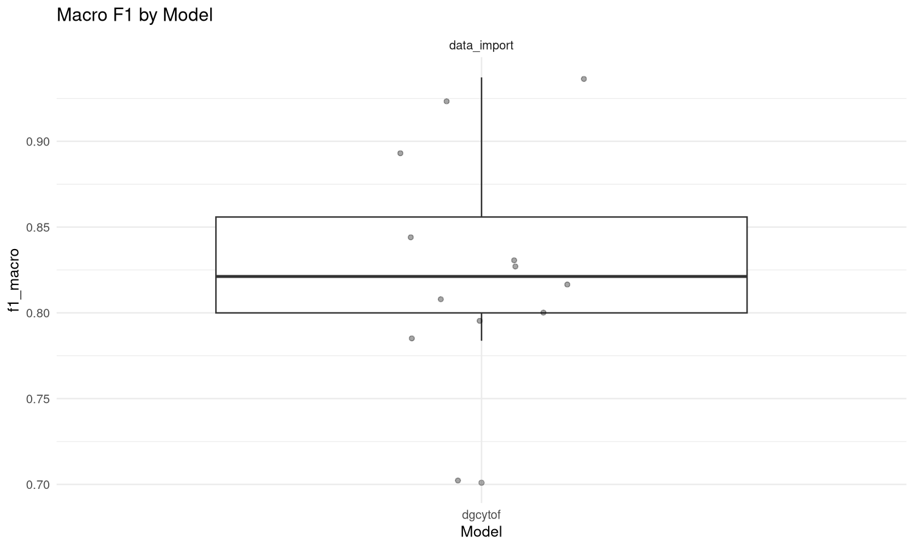
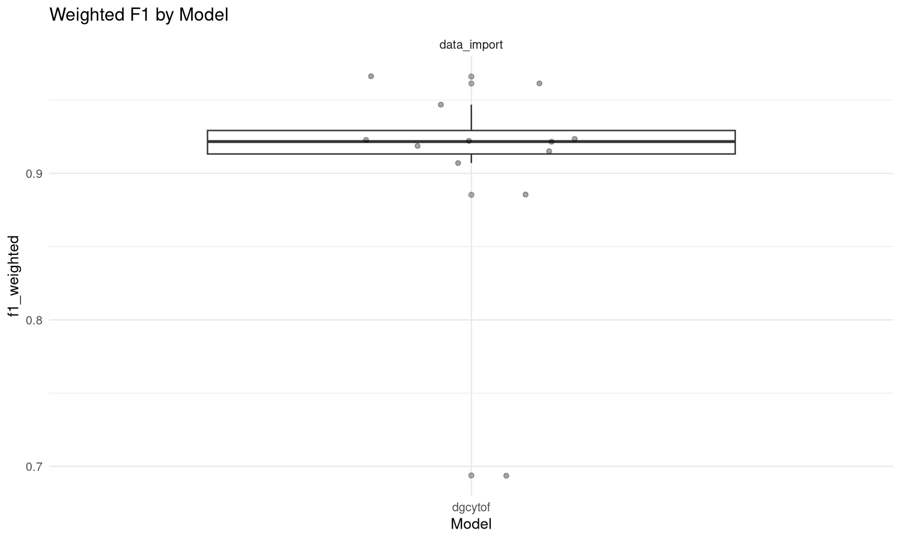
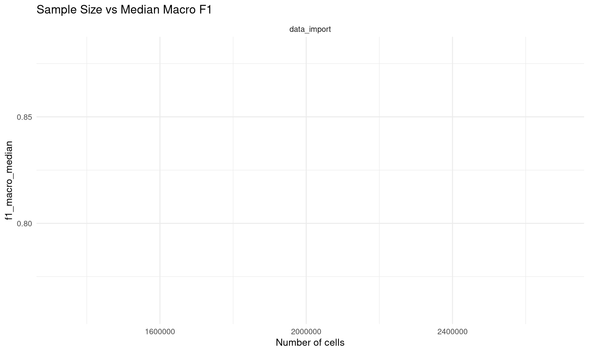
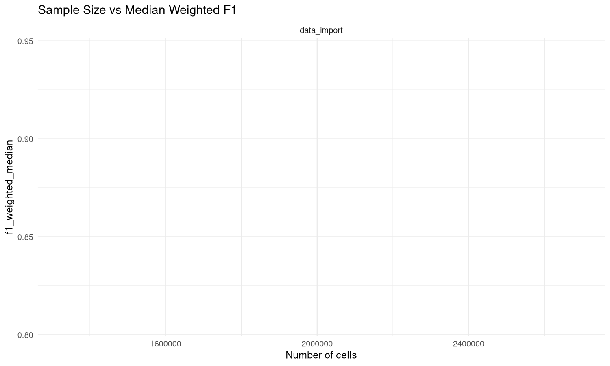

```{r setup, include=FALSE}
knitr::opts_chunk$set(echo = FALSE)
library(readr)
library(dplyr)
library(knitr)
```

## Overview

```{r}
macro_table <- read_tsv('f1_macro_by_crossvalidation.tsv')
weighted_table <- read_tsv('f1_weighted_by_crossvalidation.tsv')
summary_counts <- macro_table %>% summarize(
  datasets = n_distinct(dataset),
  models = n_distinct(model),
  crossvalidations = n_distinct(crossvalidation)
)
kable(summary_counts)
```

## Macro F1 By Crossvalidation

```{r}
kable(macro_table)
```

## Weighted F1 By Crossvalidation

```{r}
kable(weighted_table)
```

## Plots

```{r}

```

```{r}

```

```{r}
if (file.exists('plots/samples_vs_f1_macro.png')) 
```

```{r}
if (file.exists('plots/samples_vs_f1_weighted.png')) 
```

## Outputs

```{r}
outputs <- data.frame(
  file = c(
    'f1_macro_by_crossvalidation.tsv',
    'f1_weighted_by_crossvalidation.tsv',
    'f1_macro_summary_by_model.tsv',
    'f1_weighted_summary_by_model.tsv',
    'samples_vs_f1_macro.tsv',
    'samples_vs_f1_weighted.tsv'
  )
)
kable(outputs)
```

